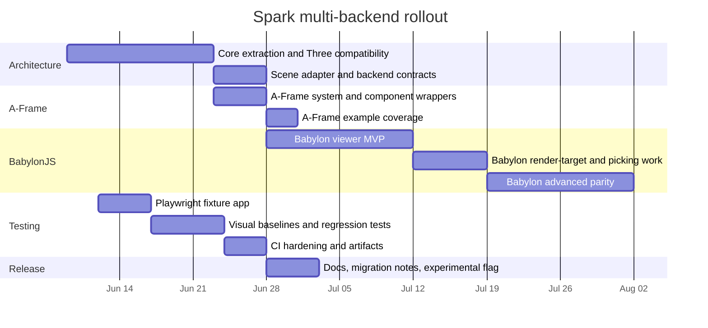

# AGENTS.md

Behavioral guidelines to reduce common LLM coding mistakes. Merge with project-specific instructions as needed.

Tradeoff: These guidelines bias toward caution over speed. For trivial tasks, use judgment.

1. Think Before Coding
Don't assume. Don't hide confusion. Surface tradeoffs.

Before implementing:

State your assumptions explicitly. If uncertain, ask.
If multiple interpretations exist, present them - don't pick silently.
If a simpler approach exists, say so. Push back when warranted.
If something is unclear, stop. Name what's confusing. Ask.
2. Simplicity First
Minimum code that solves the problem. Nothing speculative.

No features beyond what was asked.
No abstractions for single-use code.
No "flexibility" or "configurability" that wasn't requested.
No error handling for impossible scenarios.
If you write 200 lines and it could be 50, rewrite it.
Ask yourself: "Would a senior engineer say this is overcomplicated?" If yes, simplify.

3. Surgical Changes
Touch only what you must. Clean up only your own mess.

When editing existing code:

Don't "improve" adjacent code, comments, or formatting.
Don't refactor things that aren't broken.
Match existing style, even if you'd do it differently.
If you notice unrelated dead code, mention it - don't delete it.
When your changes create orphans:

Remove imports/variables/functions that YOUR changes made unused.
Don't remove pre-existing dead code unless asked.
The test: Every changed line should trace directly to the user's request.

4. Goal-Driven Execution
Define success criteria. Loop until verified.

Transform tasks into verifiable goals:

"Add validation" → "Write tests for invalid inputs, then make them pass"
"Fix the bug" → "Write a test that reproduces it, then make it pass"
"Refactor X" → "Ensure tests pass before and after"
For multi-step tasks, state a brief plan:

1. [Step] → verify: [check]
2. [Step] → verify: [check]
3. [Step] → verify: [check]
Strong success criteria let you loop independently. Weak criteria ("make it work") require constant clarification.

These guidelines are working if: fewer unnecessary changes in diffs, fewer rewrites due to overcomplication, and clarifying questions come before implementation rather than after mistakes.

Shared instructions for coding agents working in the Nova64 repository.

## Single Source of Truth

`AGENTS.md` is the only canonical source for agent-facing repository instructions. Tool-specific files such as `CLAUDE.md`, `CODEX.md`, `COPILOT.md`, and `GEMINI.md` must stay as thin pointers to this file, not independent guides.

When changing agent workflow, commands, architecture notes, or repository rules:

- Update `AGENTS.md` first.
- Keep tool-specific files limited to a short redirect to `AGENTS.md`.
- Do not copy large instruction blocks into tool-specific files.
- If another instruction file disagrees with `AGENTS.md`, verify against live source files and then reconcile the rule back here.


## 🖥️ **Windows Development Environment**

On Windows, always prefer WSL for repository work. Use WSL as the default shell for normal development, file inspection, search, `pnpm`, build, lint, format, and test commands.

```bash
# First, open WSL, then select Node 20
nvm use 20

# Now you can run pnpm commands
pnpm dev
```

Key points:

- Always use WSL for primary repo development on Windows.
- Prefer WSL even when a command could also run in PowerShell.
- Run `nvm use 20` before `pnpm` commands when working in WSL.
- Use `pnpm` for dependency installs and package scripts.
- On `/mnt/c`, use `pnpm run deps:install`; it installs with pnpm's virtual store under `~/ai-tools/spark-pnpm-store` to avoid rename permission errors on Windows-mounted filesystems.
- Keep the repo install settings for WSL installs on `/mnt/c`.
- Use native Windows tools only when the workflow specifically requires them, such as Godot `.exe` launches, Windows-only PowerShell scripts, or inspecting Windows-specific paths.
- Keep command guidance aligned with the scripts defined in `package.json`.
- Do not rewrite repository instructions around another package manager unless the repo itself changes.

## MemPalace Memory

MemPalace is installed in WSL at `~/ai-tools/mempalace/bin/mempalace`.

Searches should use `--wing spark` so results stay focused on this project.

Project-local MemPalace files, including `mempalace.yaml` and `entities.json`, are intentionally untracked and ignored by Git.

Use `CODEX.md` as the Codex-facing instruction file; it is a symlink that points back to `AGENTS.md`.

Convenience scripts are available from WSL:

```bash
pnpm run memory:wake
pnpm run memory:status
pnpm run memory:search -- "A-Frame Babylon backend adapters"
pnpm run memory:mine
```

## Backend Visual Parity Goal

100% visual parity across **every** rendering backend (Three.js, A-Frame, BabylonJS) on **every** example in `examples/` is a hard release gate, not a stretch goal.

Why this is a gate, not a polish item:

- Spark is positioned as a single Gaussian-splat renderer that "just works" in the user's engine of choice. If a Babylon-hosted scene drifts visually from the Three-hosted equivalent of the same example, the product promise breaks.
- Every example becomes a parity test asset. The Playwright per-backend screenshot suite is the gate: each example gets a baseline per backend, and CI fails on drift beyond the agreed pixel-diff tolerance.

Current parity status (2026-06-10):

- **Three.js (native)** — Spark's home environment. The parity baseline.
- **A-Frame** — bit-perfect against Three on the entire matrix. NOTE: today's `aframe-${scene}` captures exercise `registerSparkAFrame` against a structural mock, NOT a real `<a-scene>`, because A-Frame's npm and CDN builds both bundle `super-three@0.173.x` (cross-namespace Three would break splat rendering). Phase G of `MULTI-BACKEND-PARITY-PLAN.md` tracks vendoring a from-source A-Frame build for a real-scene gate.
- **Babylon — texture-bridge MVP (default)** — bit-perfect against Three on every matrix scene at the 5% tolerance the texture path was designed for. Splats composite as a background `Layer`; Babylon meshes cannot occlude them.
- **Babylon — native material (opt-in via `mode: "native"`)** — bit-perfect (0 / 786432 pixels differ) against Three on 18/19 matrix scenes. Splats render as a real Babylon `Mesh` inside the scene's render pass; Babylon meshes depth-sort against splats by construction. See `examples/spark-babylon-native/` for a working demo. The one exclusion is `envMap` — its `rubberduck.glb` non-splat Three mesh doesn't bridge to Babylon's render pass in native mode; rationale and follow-up captured next to the `NATIVE_BABYLON_SCENES` set in `tests/e2e/snapshot.spec.ts`.

How to apply this rule in day-to-day work:

- The test fixture matrix (`?backend=three|aframe|babylon`, `?scene=<example-id>`) is mandatory. Do not ship a backend that cannot run the full example matrix.
- Babylon parity expansion — modifiers, edits, portals, precise per-splat pick, LoD consistency — is **part of the release gate**, not "post-MVP polish". Do not promise a Babylon ship date that assumes those land later.
- Capability flags such as `nativeGaussianSplatting` route for performance, not as parity escape hatches. If Babylon's native splatting path drifts from the Spark Three path on any example, route that scene through Spark's custom-material Babylon path instead.
- LoD policy, sort intervals, splat encoding ranges, color-space conversions, and modifier evaluation order must be parameter-identical across backends. Any per-backend tuning needed to maintain parity goes into the adapter, never into the core runtime.
- A-Frame inherits parity for free as long as it stays a thin host adapter on the Three backend. Do not add A-Frame-only code paths that bypass the Three backend; any divergence breaks parity by construction.
- For new Babylon scenes that need depth-sort against non-splat meshes, prefer the native material path (`mode: "native"`). Texture-mode is the safe default for consumers who only need splat-as-background.

## Commit Conventions

All commits use Conventional Commits with rich detail bodies.

Format:

```
<type>(<optional scope>): <imperative short summary, ≤72 chars>

<body — multiple paragraphs covering what, why, and non-obvious tradeoffs>

<optional footer — issue refs, BREAKING CHANGE notes, co-authors>
```

Allowed types: `feat`, `fix`, `docs`, `style`, `refactor`, `perf`, `test`, `build`, `ci`, `chore`, `revert`.

The body is required for any substantive change. It must cover:

- **Why** this change is happening now — the constraint, decision, regression, or upstream choice that motivated it.
- **What** changed at the conceptual level, not just a file list.
- **How** it interacts with adjacent systems — other backends, examples, public exports, the parity baseline.
- **What was deferred** and why — follow-up commits expected, parity gaps still open.
- **How it was verified** — `pnpm run test` results, Playwright runs, manual screenshots, parity diffs.

Public-API rules:

- Three exports (`SparkRenderer`, `SplatMesh`, `SparkXr`, `SparkControls`, `SparkPortals`) must stay import-compatible. Any break requires explicit project-owner sign-off and a `BREAKING CHANGE:` footer naming the affected exports and the migration path.
- Use scope when the change is localized: `feat(backends): …`, `refactor(SparkRenderer): …`, `test(e2e): …`.

Match depth to change: a docs typo gets one short paragraph; a runtime-interface refactor gets the full breakdown. Do not pad trivial changes; do not truncate substantive ones.

Co-author attribution stays in the commit footer per existing repo style.

Example for a runtime-interface change:

```
refactor(backends): extract SparkHostSceneAdapter and Three impl

Introduce SparkHostSceneAdapter<NodeHandle, CameraHandle, SceneHandle>
as the engine-neutral surface for scene traversal, camera resolution,
and drawing-buffer size. Add ThreeHostSceneAdapter, which absorbs the
XR camera substitution and the Apple Vision Pro 1x1 baseLayer fallback
previously inlined in SparkRenderer.onBeforeRender.

This is the first runtime-interface seam from the multi-backend plan
(deep-research-report.md). SparkRenderer is not yet rewired — that
follows in a separate commit so the public Three render path stays
bit-identical until the adapter contract is reviewed.

Verified: pnpm run test (6/6 pass), biome clean on the new files.
Parity: no example output changed; screenshot baselines unaffected.
```

## Communication: Detail and Context

All communication on this project — commit bodies, PR descriptions, code review comments, design proposals, in-chat reports back to the project owner, AGENTS.md edits, and memory entries — must include detail and context proportional to the size of the change.

Every artifact should answer:

- **Why now** — the underlying constraint or decision.
- **What conceptually** — the change at the design level, not just a file list.
- **How it ripples** — other backends, examples, public API, parity baseline.
- **What was deferred** — follow-up work, gaps still open, intentional omissions.
- **How it was verified** — tests run, parity screenshots, manual checks, what is still unverified.

Memory entries (MemPalace drawers and local memory files) follow the same shape: lead with the rule or fact, then a **Why:** line and a **How to apply:** line. Bare bullet rules without rationale do not belong in `AGENTS.md` or in memory.

Scaling rule: match depth to the change. A docs typo gets one paragraph. A refactor that crosses a runtime-interface seam gets the full breakdown. Do not pad trivial changes; do not truncate substantive ones. When unsure, err on the side of more context — review friction from a too-short message costs more than a few extra lines.


# Extending Spark for Multiple Rendering Backends

## Executive summary

The current `seacloud9/spark` codebase is explicitly positioned and packaged as “an advanced 3D Gaussian Splatting renderer for THREE.js,” and the public API today is built around Three-centric classes such as `SparkRenderer`, `SplatMesh`, `SplatGenerator`, `SparkXr`, `SparkControls`, and `SparkPortals`. The package exports those modules from `src/index.ts`, uses Vite for builds, uses a local Rust-generated `spark-rs` package for Wasm, and currently has only a minimal Node test plus lightweight GitHub Actions workflows for linting and unit tests. citeturn44view0turn46view0turn46view1turn46view2turn46view3turn46view4turn46view5turn17view0turn16view0turn16view1turn47view0

The most important architectural fact is that Spark is not just “using Three.js for drawing.” It is structurally coupled to Three’s scene graph and renderer lifecycle. `SplatGenerator` extends `THREE.Object3D`; `SplatMesh` extends `SplatGenerator`; `SparkRenderer` extends `THREE.Mesh` and relies on `onBeforeRender`; `SplatAccumulator.prepareGenerate()` traverses a `THREE.Scene` and filters `SplatGenerator` instances with `scene.traverseVisible()` and camera layers; `SplatMesh.update()` and `SparkXr` depend on `THREE.Matrix4`, `THREE.Vector*`, `renderer.xr`, and `THREE.WebXRManager`; and `SparkPortals` runs a two-pass portal algorithm with two `SparkRenderer` instances. citeturn20view0turn20view4turn43view3turn31view1turn31view2turn27view0turn27view2turn12view0turn12view1turn21view7turn22view0turn22view3turn32view0turn32view3

Because of that, the least-risk path is **not** to bolt BabylonJS directly onto the current class tree. The right migration is to split Spark into a shared engine-neutral core plus backend adapters. I recommend treating **A-Frame as a host/integration adapter that reuses the Three backend**—because A-Frame’s scene bootstraps Three.js, exposes `THREE.Object3D` through entities, and configures a `THREE.WebGLRenderer`—while treating **BabylonJS as the first genuinely separate rendering backend**. That gives you an incremental delivery strategy: preserve Three.js compatibility first, land A-Frame quickly, then build a BabylonJS MVP with explicit feature flags for gaps. citeturn36search0turn36search2turn36search11turn33search0turn33search4turn33search8turn36search4

The fastest route to value is therefore:

- extract a backend-neutral runtime and scene adapter layer while preserving all current Three.js exports;
- ship an **A-Frame adapter** on top of that Three runtime first;
- ship a **BabylonJS viewer/MVP backend** second, with staged parity for precise picking, edits, portals, and XR;
- add **Playwright browser tests and screenshot regression** across backends;
- expand CI to cover **Wasm build, browser tests, artifacts, traces, and HTML reports**. citeturn44view0turn16view0turn16view1turn39search0turn39search7turn39search8turn41search11turn41search15

## What the repository looks like now

### Key entry points and current change surface

The public package entry point is `src/index.ts`. It exports `SparkRenderer`, `SplatAccumulator`, `SplatMesh`, generators/modifiers, `SparkXr`, XR hand helpers, `SparkControls`, utility functions, and `SparkPortals`. The package metadata declares Vite-based build scripts, a `build:wasm` script, and a Node-based test command. The README says local development requires building the Rust Wasm component before building Spark itself, and the examples index exposes a large feature surface including environment maps, interactivity, multiple viewpoints, raycasting, dynamic lighting, shader effects, transitions, WebXR, depth of field, portals-like render tricks, and LoD/streaming demos. citeturn46view0turn46view1turn46view2turn46view3turn46view4turn46view5turn44view0turn47view0turn14view1

| Current file or area | Current role | Why it matters for multi-backend work | Recommended action |
|---|---|---|---|
| `src/index.ts` | Public API surface and exports | Determines backward-compatibility strategy | Keep current exports stable; add new backend exports alongside them |
| `src/SparkRenderer.ts` | Main renderer object; custom shader material; offscreen target support; render-loop hook | This is the deepest renderer coupling point | Split into `core` runtime plus `three` adapter first |
| `src/SplatAccumulator.ts` | Scene traversal, generator collection, mapping, visible set computation | Currently assumes `THREE.Scene`, `traverse`, `traverseVisible`, layers | Move traversal behind a scene adapter interface |
| `src/SplatGenerator.ts` | Base node abstraction; currently extends `THREE.Object3D` | Prevents engine-neutral node model | Introduce a core model object and keep a Three wrapper |
| `src/SplatMesh.ts` | File loading, LOD, edits, raycasting, modifiers, per-frame updates | Large behavioral surface that should remain backend-neutral where possible | Split model/loading/pipeline logic from engine host object |
| `src/SparkPortals.ts` | Two-pass rendering with two `SparkRenderer`s | Advanced feature; depends on render targets and consistent LOD across passes | Defer Babylon parity until viewer MVP is stable |
| `src/SparkXr.ts` | XR session integration via `renderer.xr` | Backend-specific; different XR APIs in Babylon and A-Frame | Put behind capability-gated backend modules |
| `src/controls.ts` | Input/navigation and optional WebXRManager integration | More host-specific than renderer-specific | Keep separate from core runtime |
| `test/utils.test.ts` | Minimal Node-only test | Insufficient for backend work | Add Playwright and contract tests |
| `.github/workflows/*` | Current CI and docs/dist deployment | Browser testing and Wasm build are missing from main CI | Add dedicated browser/Wasm workflows and artifacts |

The table above is derived from the package exports, Spark class definitions, accumulator traversal logic, mesh option surface, XR/controls/portals modules, and current workflows. citeturn46view0turn46view1turn46view2turn46view3turn46view4turn46view5turn27view0turn27view2turn31view1turn31view2turn20view0turn20view4turn42view0turn43view3turn21view7turn22view0turn32view0turn32view3turn17view0turn16view0turn16view1turn16view2turn16view3

### Where the Three.js coupling is strongest

`SparkRenderer` is currently a `THREE.Mesh` backed by `THREE.ShaderMaterial`, `THREE.DataTexture`, `THREE.WebGLRenderTarget`, and `onBeforeRender`. It computes render size using `renderer.getDrawingBufferSize`, switches behavior when `renderer.xr.isPresenting`, copies matrices from the active camera, and performs auto-update inside the Three render lifecycle. citeturn27view0turn27view2turn38search1turn38search2turn38search3turn37search2turn38search0

`SplatAccumulator.prepareGenerate()` traverses the scene twice: once to collect all generators for frame updates and edits, and once to collect visible generators for mapping and actual generation. That makes the scene graph, visibility rules, and layer semantics part of the renderer contract today, even though they are not formalized as such. citeturn31view1turn31view2turn38search0

`SplatMesh` mixes several concerns in one class: file/stream loading, splat source ownership, LoD toggles, world/object modifiers, edits, view-dependent transforms, bounding-box introspection, per-splat iteration, raycasting, and runtime generator compilation. That is good functionality, but it means a Babylon port should *not* start by mechanically reproducing this class as a Babylon `Mesh`; it should start by separating its **model/runtime logic** from its **host object identity**. citeturn42view0turn42view1turn42view4turn42view5turn42view7turn42view8turn42view11turn43view3turn43view6turn43view8turn12view0turn12view1turn12view2

## Recommended architecture

### The right abstraction boundary

I recommend a **two-layer design**:

- a **shared Spark core** that owns splat loading, LoD policy, edits/modifiers, mapping, worker/Wasm orchestration, capability negotiation, and feature flags;
- a **host adapter layer** that translates Spark core operations into engine-specific scene/renderer/camera/material/texture semantics.

That design fits the repo better than a single giant `Backend` object because A-Frame is not a separate low-level renderer in practice; it is a scene/lifecycle layer over Three.js. BabylonJS, by contrast, has its own render loop, scene graph, observables, render target system, picking APIs, XR helpers, and material stack. A-Frame therefore belongs mostly in the **host adapter** layer, while BabylonJS needs both a **host adapter** and a **render backend**. citeturn36search0turn36search2turn36search11turn33search0turn33search8turn36search4turn45search0turn45search8turn34search0turn45search1turn45search15

### Proposed interface

A practical interface for Spark should make lifecycle, capability checks, render targets, and picking explicit.

```ts
export type SparkBackendKind = "three" | "aframe" | "babylon";

export interface SparkBackendCapabilities {
  preciseRaycast: boolean;
  nativeGaussianSplatting: boolean;
  offscreenTargets: boolean;
  portals: boolean;
  webxr: boolean;
  customShaders: boolean;
}

export interface SparkFrameContext {
  nowSec: number;
  deltaSec: number;
  viewportWidth: number;
  viewportHeight: number;
  xrPresenting: boolean;
}

export interface SparkHostSceneAdapter<NodeHandle = unknown, CameraHandle = unknown> {
  getActiveCamera(): CameraHandle | null;
  getViewportSize(): { width: number; height: number };
  traverseAll(visitor: (node: NodeHandle) => void): void;
  traverseVisible(visitor: (node: NodeHandle) => void): void;
  requestRender(): void;
  onFrame(cb: (frame: SparkFrameContext) => void): () => void;
  onResize(cb: (size: { width: number; height: number }) => void): () => void;
  onDispose(cb: () => void): () => void;
}

export interface SparkRenderBackend<RenderableHandle = unknown> {
  readonly kind: SparkBackendKind;
  readonly capabilities: SparkBackendCapabilities;

  init(): Promise<void> | void;
  attachRuntime(runtime: SparkRuntimeCore): void;

  createRenderable(node: SparkNodeModel): RenderableHandle;
  updateRenderable(node: SparkNodeModel, handle: RenderableHandle): void;
  destroyRenderable(handle: RenderableHandle): void;

  render(scene: SparkHostSceneAdapter): Promise<void> | void;
  raycast(req: SparkRaycastRequest): SparkPickResult[];

  createRenderTarget(opts: SparkRenderTargetOptions): SparkRenderTargetHandle;
  readPixels(target: SparkRenderTargetHandle): Promise<Uint8Array>;

  dispose(): void;
}
```

This interface is a proposal, but it is anchored in real coupling seams in the current code: render-loop callbacks, visible traversal, camera matrices, raycasting, render targets, and XR state are all already implicit dependencies of Spark’s implementation. citeturn31view1turn31view2turn27view2turn10view5turn21view7turn27view0turn38search0turn37search2

### Concrete module layout

I would introduce a new layout like this:

```text
src/
  core/
    SparkRuntimeCore.ts
    SparkNodeModel.ts
    SparkSceneModel.ts
    SparkCapabilities.ts
    math.ts
    events.ts
  backends/
    types.ts
    three/
      ThreeSceneAdapter.ts
      ThreeRenderBackend.ts
      ThreeSplatMesh.ts
      ThreeSparkRenderer.ts
    aframe/
      AFrameSceneAdapter.ts
      aframe-system.ts
      aframe-components.ts
    babylon/
      BabylonSceneAdapter.ts
      BabylonRenderBackend.ts
      BabylonSplatNode.ts
      BabylonPortals.ts
  compat/
    three-exports.ts
```

The most important rule is that **current exports stay alive**. `SparkRenderer`, `SplatMesh`, `SparkXr`, `SparkControls`, and `SparkPortals` should remain import-compatible for existing Three.js users, but their internals can delegate to `core/` plus `backends/three/`. That gives you an incremental migration instead of a flag day. citeturn46view0turn46view1turn46view2turn46view3turn46view4turn46view5

### Backward compatibility strategy

A safe compatibility plan looks like this:

- keep `SparkRendererOptions` and `SplatMeshOptions` stable for the existing Three.js path;
- add a new optional backend selector only in new factory-style APIs, not in old constructors;
- preserve `THREE.Object3D` inheritance in the existing Three wrappers;
- introduce new engine-neutral APIs under new exports such as `createSparkRuntime`, `createAFrameSparkSystem`, and `createBabylonSparkRuntime`;
- mark BabylonJS features that are not yet equivalent as experimental rather than silently degrading.

That matters because the current package is already consumed as a Three.js library, and its README and package metadata reinforce that positioning. citeturn44view0turn47view0

## Backend-specific mapping

### Why A-Frame should be a thin wrapper first

A-Frame’s `<a-scene>` handles the Three/WebXR/renderer boilerplate, its renderer system configures a `THREE.WebGLRenderer`, entities expose `THREE.Object3D` instances via `object3DMap`, and components/systems already provide a clean lifecycle with `init`, `update`, `play`, `pause`, `tick`, and `tock`. That makes A-Frame a very strong fit for a **thin host adapter** over the current Three backend rather than a separate renderer fork. citeturn36search0turn36search2turn36search11turn33search0turn33search4turn33search8turn36search4turn36search19

An A-Frame integration should therefore look like this:

```ts
// src/backends/aframe/aframe-system.ts
AFRAME.registerSystem("spark", {
  init() {
    this.runtime = createSparkRuntime({
      backend: createThreeBackend({
        renderer: this.el.renderer,
        scene: this.el.object3D,
        camera: () => this.el.camera
      })
    });

    this.offFrame = this.runtime.attachHost(
      new AFrameSceneAdapter(this.el)
    );
  },

  tick(timeMs, deltaMs) {
    this.runtime.frame({
      nowSec: timeMs / 1000,
      deltaSec: deltaMs / 1000
    });
  },

  remove() {
    this.offFrame?.();
    this.runtime?.dispose();
  }
});

// src/backends/aframe/aframe-components.ts
AFRAME.registerComponent("spark-splat", {
  schema: {
    src: { type: "string" },
    editable: { type: "boolean", default: true }
  },

  async init() {
    this.mesh = await createThreeSplatMesh({
      url: this.data.src,
      editable: this.data.editable
    });

    this.el.setObject3D("spark-splat", this.mesh);
  },

  update(oldData) {
    if (oldData.src !== this.data.src) {
      this.mesh?.reinitialize?.({ url: this.data.src });
    }
  },

  remove() {
    this.mesh?.dispose?.();
    this.el.removeObject3D("spark-splat");
  }
});
```

This code is a proposal, but it is directly aligned with A-Frame’s official entity/object3D and component/system lifecycles. citeturn33search0turn33search4turn33search8turn36search4

### Why BabylonJS needs a real backend

BabylonJS is more different. Its render loop is built around scene observables such as `onBeforeRenderObservable`, it uses `RenderTargetTexture` for RTT workflows, it supports XR through `WebXRDefaultExperience`, and picking goes through `scene.pickWithRay()` and related APIs. BabylonJS also has official Gaussian Splatting documentation, but the docs explicitly note a parity gap for picking: because Gaussian splats do not have triangle geometry, standard ray-based picking falls back to bounding-volume intersection, with separate utilities recommended for more accurate picking. citeturn45search0turn45search8turn34search0turn45search15turn45search1turn45search5turn45search6turn45search2

That means the Babylon plan should be consciously staged:

- **MVP**: viewer, camera transforms, loading, render loop, resize, basic picks, screenshots, offscreen support;
- **next**: custom material path for Spark-like uniforms and modifiers;
- **later**: precise per-splat picking, portals, shared LOD across multi-pass, XR parity, and edit pipelines.

A practical Babylon backend skeleton would look like this:

```ts
import {
  Scene,
  Engine,
  TransformNode,
  RenderTargetTexture,
  WebXRDefaultExperience
} from "@babylonjs/core";

export class BabylonRenderBackend implements SparkRenderBackend<TransformNode> {
  kind = "babylon" as const;

  capabilities = {
    preciseRaycast: false,             // until custom pick path lands
    nativeGaussianSplatting: true,     // use when feature-compatible
    offscreenTargets: true,
    portals: true,                     // but phase later
    webxr: true,
    customShaders: true
  };

  constructor(
    private readonly engine: Engine,
    private readonly scene: Scene
  ) {}

  init() {
    this.beforeRenderObs = this.scene.onBeforeRenderObservable.add(() => {
      this.runtime.frame(this.buildFrameContext());
    });
  }

  createRenderable(node: SparkNodeModel) {
    const host = new TransformNode(node.id, this.scene);

    if (node.kind === "splat" && node.canUseNativeBabylonPath()) {
      host.metadata = new BabylonGaussianBridge(node, this.scene);
    } else {
      host.metadata = new BabylonSparkMaterialBridge(node, this.scene);
    }

    return host;
  }

  async enableXR() {
    this.xr = await WebXRDefaultExperience.CreateAsync(this.scene, {});
  }

  createRenderTarget(opts: SparkRenderTargetOptions) {
    return new RenderTargetTexture(`spark-rt-${crypto.randomUUID()}`, {
      width: opts.width,
      height: opts.height
    }, this.scene);
  }

  raycast(req: SparkRaycastRequest) {
    // MVP: scene.pickWithRay()
    // Later: Spark-specific per-splat pick path
    return mapBabylonPick(this.scene.pickWithRay(req.ray));
  }
}
```

The core design choice here is **dual-path rendering**. Where Babylon’s built-in Gaussian splatting is sufficient, use it for speed. Where Spark’s custom modifiers, edit layers, exact picking, or portal/Lod behavior require tighter control, fall back to a Spark-specific Babylon material/texture path. That is much cheaper than trying to port every Spark feature into Babylon on day one. citeturn45search2turn45search10turn45search3turn45search6turn34search0turn45search15turn45search1turn45search5

### Feature mapping and parity gaps

| Capability used by Spark | Current Three.js path | A-Frame path | BabylonJS path | Recommended parity target |
|---|---|---|---|---|
| Scene graph traversal and visibility | Native via `Object3D`, `traverseVisible`, layers | Reuse underlying Three scene and entity `object3D` | Custom adapter over Babylon scene graph and masks | Full in Three/A-Frame first; partial in Babylon MVP |
| Render lifecycle hook | `onBeforeRender` on `THREE.Object3D` | `tick`/`tock` plus underlying Three lifecycle | `onBeforeRenderObservable` | Full |
| Custom shaders | `THREE.ShaderMaterial` | Same, through underlying Three | Babylon `ShaderMaterial` / `Node Material` | Full, but with a separate implementation |
| Raw texture-backed splat buffers | `THREE.DataTexture` | Same, via Three | Babylon raw texture/material path | Full |
| Offscreen render targets | `THREE.WebGLRenderTarget` | Same, via Three scene renderer | `RenderTargetTexture` and multi-pass patterns | Full |
| WebXR | `renderer.xr` / `THREE.WebXRManager` | Built-in A-Frame WebXR scene setup | `WebXRDefaultExperience` | Full, but different APIs |
| Raycasting / picking | Spark implements `raycast()` in Three API | Use underlying Three picking or A-Frame wrappers | Standard Babylon picking exists, but Gaussian splats fall back to bounds by default | Partial in Babylon MVP; full later |
| Portals / multi-pass viewpoints | Already supported with dual `SparkRenderer` approach | Reuse current behavior via Three integration | Possible via RTT + multi-pass, but needs custom clipping and LoD consistency | Defer until after Babylon viewer stabilizes |
| Precise layer semantics | Native Three layers | Inherited from Three | Map to Babylon masks or render groups, not identical | Document behavior differences |
| Existing controls/helpers | `SparkControls`, `SparkXr`, `SparkPortals` are Three-native | Wrap or expose as A-Frame components | Reimplement as Babylon helpers | Stage after core renderer |

This comparison is grounded in Spark’s current use of Three render hooks, object inheritance, scene traversal, raycasting, render targets, XR, and portals, together with official A-Frame docs showing direct Three integration and BabylonJS docs covering observables, render targets, XR helpers, picking, and Gaussian splatting limitations. citeturn38search0turn38search1turn38search2turn38search3turn37search2turn31view1turn31view2turn10view5turn21view7turn32view0turn32view3turn36search0turn36search2turn36search11turn33search0turn33search8turn45search0turn45search8turn34search0turn45search1turn45search5turn45search6turn45search2turn45search15

## Testing, Playwright, and CI

### Current testing and CI baseline

Today the repository’s tests are effectively limited to a single Node test asserting `floatToUint8`, and the two primary CI workflows on Linux and Windows run `pnpm install`, `pnpm run lint`, and `pnpm run test`. The package does not currently declare Playwright, and the main CI workflows do not exercise browser rendering or the Wasm build path even though the project has explicit `build:wasm` and `build` scripts. citeturn17view0turn16view0turn16view1turn44view0

That is not enough for backend work. Multi-backend rendering changes need **browser-level behavior tests** and **visual regression tests**, because many failures will be semantic rather than type-level: wrong camera matrix, transparent pass order drift, incorrect render-target color space, LoD inconsistencies, or picking mismatches. Spark’s own examples already give you a ready-made scenario catalog for that test matrix. citeturn14view1turn27view0turn27view2turn32view3

### Recommended Playwright setup

Playwright is a good fit because it gives you:

- a `webServer` configuration to start a local server before tests;
- test `projects` to run the same suite against multiple browsers;
- screenshot assertions via `expect(page).toHaveScreenshot()`;
- trace capture and optional video retention on failure;
- GitHub reporter annotations and CI guidance for GitHub Actions. citeturn39search8turn39search1turn39search7turn39search3turn39search14turn41search11turn41search15turn39search0

I would add these dev dependencies:

```json
{
  "devDependencies": {
    "@playwright/test": "^1.x",
    "aframe": "^1.7.0",
    "@babylonjs/core": "^7.x",
    "@babylonjs/loaders": "^7.x",
    "gl-matrix": "^3.x"
  }
}
```

This is a recommendation, not a statement about current repo contents. The important factual point is that the repo currently lacks Playwright and backend-specific packages, so these need to be added deliberately. citeturn44view0

A suitable `playwright.config.ts` would look like this:

```ts
import { defineConfig, devices } from "@playwright/test";

export default defineConfig({
  testDir: "./tests/e2e",
  fullyParallel: true,
  retries: process.env.CI ? 2 : 0,
  reporter: process.env.CI ? [["github"], ["html"]] : [["html"]],
  use: {
    baseURL: "http://127.0.0.1:4173",
    viewport: { width: 1280, height: 720 },
    deviceScaleFactor: 1,
    trace: "retain-on-failure",
    video: "retain-on-failure"
  },
  expect: {
    toHaveScreenshot: {
      animations: "disabled"
    }
  },
  webServer: {
    command: "pnpm run build && pnpm exec vite preview --host 127.0.0.1 --port 4173",
    url: "http://127.0.0.1:4173",
    reuseExistingServer: !process.env.CI
  },
  projects: [
    { name: "chromium", use: { ...devices["Desktop Chrome"] } },
    { name: "firefox", use: { ...devices["Desktop Firefox"] } },
    { name: "webkit", use: { ...devices["Desktop Safari"] } }
  ]
});
```

The configuration above is aligned with Playwright’s official guidance for config files, `webServer`, multi-browser projects, screenshot assertions, and traces/videos. citeturn39search5turn39search8turn39search1turn39search12turn39search7turn39search3turn39search14turn41search11

### Test cases and fixtures

I would build a shared fixture app at `tests/fixtures/viewer-app/` that accepts query parameters like `?backend=three`, `?backend=aframe`, and `?backend=babylon`, plus scenario IDs like `?scene=hello-world` and `?scene=raycasting`. Using the same scene data across all backends is critical; otherwise you will spend more time debugging test fixtures than debugging the renderer.

The first wave of high-value tests should be:

| Test case | Three | A-Frame | Babylon | Purpose |
|---|---:|---:|---:|---|
| Load a simple splat scene | Yes | Yes | Yes | Backend smoke test |
| Multiple splat objects sort/render | Yes | Yes | Yes | Cross-object ordering correctness |
| Resize and DPR-stable screenshot | Yes | Yes | Yes | Viewport/matrix consistency |
| Raycast center-of-screen | Yes | Yes | Yes, but looser at first | Detect picking parity gaps |
| Offscreen render target readback | Yes | Yes | Yes | Verify RTT API |
| WebXR entry point smoke | Yes | Yes | Yes | Test lifecycle plumbing, not headset hardware |
| Portal scene screenshot | Yes | Yes | Later | Advanced feature rollout |
| Edit/modifier visual parity | Yes | Yes | Later | Shader/runtime parity |

These tests are justified by the repo’s current feature surface and by the fact that Playwright screenshot testing waits for stable consecutive screenshots before comparing, which is exactly what you want for deterministic visual baselines. citeturn14view1turn33search11turn39search7

Example tests:

```ts
import { test, expect } from "@playwright/test";

for (const backend of ["three", "aframe", "babylon"] as const) {
  test(`hello-world renders on ${backend}`, async ({ page }) => {
    await page.goto(`/tests/fixtures/viewer-app/?scene=hello-world&backend=${backend}`);
    await expect(page.locator("[data-testid='spark-ready']")).toBeVisible();
    await expect(page).toHaveScreenshot(`hello-world-${backend}.png`);
  });
}

test("raycast reports selected splat", async ({ page }) => {
  await page.goto(`/tests/fixtures/viewer-app/?scene=raycasting&backend=three`);
  await page.mouse.click(640, 360);
  await expect(page.locator("[data-testid='selection-id']")).toContainText("selected:");
});
```

### Recommended GitHub Actions workflow

GitHub’s docs recommend Node setup with caching, matrix strategies, and artifact storage; Playwright’s CI docs provide the browser-install and report/trace patterns. A strong replacement for the current CI would split fast checks from browser checks. citeturn40search1turn40search2turn40search6turn41search0turn41search3turn39search4turn41search2turn41search9

```yaml
name: CI

on:
  push:
    branches: [main]
  pull_request:
    branches: [main]

concurrency:
  group: ci-${{ github.ref }}
  cancel-in-progress: true

jobs:
  verify:
    runs-on: ubuntu-latest
    steps:
      - uses: actions/checkout@v4

      - uses: actions/setup-node@v4
        with:
          node-version: 22
          cache: pnpm

      - name: Install deps
        run: pnpm install --frozen-lockfile

      - name: Build Wasm
        run: pnpm run build:wasm

      - name: Build package
        run: pnpm run build

      - name: Lint
        run: pnpm run lint

      - name: Unit tests
        run: pnpm run test

  playwright:
    runs-on: ubuntu-latest
    needs: verify
    steps:
      - uses: actions/checkout@v4

      - uses: actions/setup-node@v4
        with:
          node-version: 22
          cache: pnpm

      - name: Install deps
        run: pnpm install --frozen-lockfile

      - name: Install browsers
        run: pnpm exec playwright install --with-deps

      - name: Build Wasm
        run: pnpm run build:wasm

      - name: Run Playwright
        run: pnpm exec playwright test

      - name: Upload Playwright report
        if: always()
        uses: actions/upload-artifact@v4
        with:
          name: playwright-report
          path: |
            playwright-report
            test-results
```

That workflow is intentionally conservative: Linux remains the primary browser lane, while Windows can continue as a smoke/build lane because the repo already has a Windows workflow and you are developing in WSL, which is operationally closer to Linux for Node/Rust/browser tooling. citeturn16view1turn40search1turn40search2turn40search6turn39search4turn41search0turn41search1turn41search3

## Phased execution plan, WSL setup, and rollout

### WSL and Rust toolchain setup

Because you are developing in **Windows WSL**, I recommend treating the Linux environment as the source of truth for Node, Rust, and Playwright. The repo already includes a Linux Wasm build script that checks for `rustup`, ensures the `wasm32-unknown-unknown` target exists, installs `wasm-pack` via Cargo if needed, and then runs `wasm-pack build --target web --release` inside `rust/spark-rs` with SIMD flags. The official Rust installer page also gives a WSL-specific install command, and Cargo is installed automatically when you install Rust with rustup. citeturn49view0turn48search0turn48search5turn48search1turn48search3

Use this in WSL:

```bash
sudo apt-get update
sudo apt-get install -y build-essential pkg-config curl git python3

curl --proto '=https' --tlsv1.2 -sSf https://sh.rustup.rs | sh
source "$HOME/.cargo/env"

rustup target add wasm32-unknown-unknown
cargo install wasm-pack

pnpm install --frozen-lockfile
pnpm run build:wasm
pnpm run build
pnpm start
```

Those commands match the repo’s own Wasm build expectations and Rust’s official WSL/Cargo install path. citeturn49view0turn48search0turn48search5turn48search1turn48search3

### Phased plan with effort and risks

| Phase | Scope | Estimated effort | Risk | Main exit criteria |
|---|---|---:|---|---|
| Foundation | Extract core runtime, scene adapter, backend types; preserve current Three exports | 1.5–2.5 weeks | Medium to high | Current Three examples still pass |
| A-Frame integration | Add A-Frame system/components on top of Three backend | 4–6 days | Low to medium | Hello-world, load, resize, pick, screenshot tests pass |
| Babylon viewer MVP | Scene adapter, render loop, load/render, resize, basic pick, screenshot support | 2–3 weeks | High | Stable viewer and test suite on Babylon |
| Babylon parity expansion | Modifiers/edits, offscreen targets, better picking, portals/XR backlog | 2–4 weeks | High | Explicit feature checklist reaches target |
| Playwright and CI hardening | Full browser suite, visual regression, artifacts, traces, CI cleanup | 4–6 days | Medium | Reproducible failures and HTML reports in Actions |
| Rollout and docs | Docs, migration notes, examples, feature flags | 3–5 days | Low | Experimental releases, adoption guidance |

These are engineering estimates rather than source-derived facts. They assume one experienced engineer working primarily in this codebase, with some parallel help on test fixtures.

### Prioritization and milestones

The order of work should be:

1. **Protect the current Three.js path.** If this regresses, every other backend effort becomes harder.
2. **Extract the scene/renderer abstraction before adding BabylonJS.**
3. **Ship A-Frame quickly** as the first proof that the abstraction works.
4. **Ship Babylon viewer parity**, not full parity, as the first Babylon milestone.
5. **Add browser and screenshot tests before deep Babylon feature work.**
6. **Only then** tackle Babylon portals, precise picking, and XR parity.

A practical milestone definition would be:

- **Milestone Alpha**: Three backend refactor complete, no public API break.
- **Milestone Beta**: A-Frame adapter public and documented.
- **Milestone Gamma**: Babylon backend viewer MVP behind experimental flag.
- **Milestone Delta**: Playwright visual baseline in CI.
- **Milestone Release**: feature checklist meets agreed target.

### Feature parity checklist

| Feature | Three | A-Frame | Babylon MVP | Babylon target |
|---|---|---:|---:|---:|
| Load `.ply` / `.splat` / `.ksplat` / `.spz` | Baseline | Yes | Yes | Yes |
| Multiple visible splat objects | Baseline | Yes | Yes | Yes |
| Dynamic modifiers | Baseline | Yes | Partial | Yes |
| Edit layers / SDF edits | Baseline | Yes | No | Yes |
| Precise per-splat raycast | Baseline | Yes | No | Yes |
| Offscreen render target | Baseline | Yes | Yes | Yes |
| WebXR integration | Baseline | Yes | Partial | Yes |
| Portals | Baseline | Yes | No | Yes |
| LoD / paging / shared LoD consistency | Baseline | Yes | Partial | Yes |
| Screenshot regression suite | Planned | Planned | Planned | Planned |

### Phased timeline



### Final recommendation

If you want the shortest credible path, make these decisions up front:

- **A-Frame is a product-facing backend, but internally it should reuse the Three backend.**
- **BabylonJS is the first true new engine backend.**
- **Do not start the Babylon port until the scene adapter and core/runtime split exist.**
- **Do not start advanced Babylon parity until Playwright screenshots are in CI.**
- **Use WSL as the canonical dev environment** and automate Rust/Wasm setup around the repo’s existing `rustup` + `wasm-pack` flow. citeturn36search0turn36search11turn33search0turn33search8turn45search2turn45search6turn45search8turn39search7turn39search8turn39search0turn49view0turn48search0turn48search5

If you follow that sequencing, you will preserve the current library contract, get an A-Frame integration relatively quickly, and reduce the BabylonJS work from a risky rewrite into a controlled series of milestones.
